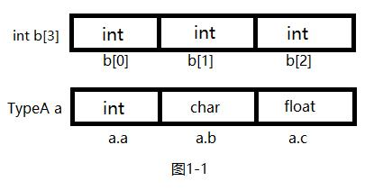

# 1.1 考研综合应用题中代码书写规范以及C语言基础
## 1.1.1 考研综合应用题中代码书写规范
> **要在纸上快速的写出能让阅卷老师满意的代码,和使用编译器编译通过的代码是有所不同的.**

例:&nbsp;&nbsp;设将n(n&gt;1)个整数存放到一维数组R中,设计一个算法,将R中的序列循环左移P(0&lt;P&lt;n)个位置,即将R中的数据由{X0,X1,...,Xn-1}变换为{Xp,Xp+1,...,Xn-1,X0,X1,...,Xp-1}.要求:写出本题的算法描述. 

分析:  
&nbsp;&nbsp;&nbsp;&nbsp; 本题不难,要实现R中序列循环左移P个位置,只需要将R中前P个元素逆置,再将剩下的元素逆置,最后将R中所有的元素在整体做一次逆置操作即可.本题算法描述如下:  
``` C
#include <stdio.h>
#define N 5

void reverse(int *arr, int l, int r) {
  int i, j;
  for (i = l, j = r; i < j; i++, j--) {
    int t;
    t = arr[i];
    arr[i] = arr[j];
    arr[j] = t;
  }
}

void RCR(int *arr, int n, int p) {
  reverse(arr, 0, p - 1);
  reverse(arr, p, n - 1);
  reverse(arr, 0, n - 1);
}

void display(int *arr, int n) {
  int i;
  for (i = 0; i < n; i++) {
    printf("%d ", arr[i]);
  }
}

int main() {
  int arr[N] = {1, 2, 3, 4, 5};  //人为规定一个测试用例
  RCR(arr, 5, 3);
  display(arr, 5);
  return 0;
}
```
以上内容为完整的,可以在编译器下编译运行的程序,程序较长,对于宝贵的卷面而言完全没有必要.
``` C
#include <stdio.h>  // 这行代码C语言必用,无法区分考试学习情况的优劣势
#define N 5         // 同上
```

``` C
void display(int *arr, int n) {  //打印函数 不是核心代码部分
  int i;
  for (i = 0; i < n; i++) {
    printf("%d ", arr[i]);
  }
}
int main() {                     //main函数,与核心代码无关
  int arr[N] = {1, 2, 3, 4, 5};  
  RCR(arr, 5, 3);
  display(arr, 5);
  return 0;
}
```

上面两部分,对于核心代码部分,都是属于多余的,在卷面有限的情况下可以省略.  

**<font  color='red'>写注释</font>**  
**<font  color='red'>写注释</font>**  
**<font  color='red'>写注释</font>**  

重要的事情要说三遍!

我们都知道,在接手别人的代码时,一般都会有交接文档.交接文档的内容,就是对于此项目的各种规范,接口的设计情况,参数的意义等等.在考研的试卷上,每个人的代码风格都各不相同,所以一个注释多的代码,会让人能够更快的理解你的代码.

下面我们来举个例子.

这是leetcode 第168题 [Excel表列名称](https://leetcode-cn.com/problems/excel-sheet-column-title/description/)

这是一段没有注释的代码
```C
/*
 * @lc app=leetcode.cn id=168 lang=c
 *
 * [168] Excel表列名称
 */

char *convertToTitle(int n) {
    if (n < 0) {
        return "";
    }
    char *res = malloc(10);
    int len = 0;
    while (n > 0) {
        res[len++] = 'A' + ((n - 1) % 26);
        n = (n - 1) / 26;
    }  
    res[len] = '\0';
    for (int i = 0; i < len / 2; i++) {
        char tmp = res[i];
        res[i] = res[len - 1 - i];
        res[len - 1 - i] = tmp;
    }
    return res;
}
```
是不是看起来非常的累,虽然满打满算只有20不到的代码,但是阅读起来却是很费劲的一件事情.

***所以我们可以给代码加上注释,使得阅卷的老师一下子就能明白我们的编码思想.***  

``` C
 /*
     本质上来说excel序号是26进制的字符序列 
     我们理由进制转换的思想来做
 */
char *convertToTitle(int n) {
    if (n < 0) { // n小于0 结果不存在
        return "";
    }
    char *res = malloc(10); // 定义返回字符串 并设置大小
    int len = 0;
    
    while (n > 0) {  // 利用循环来转换进制   
        res[len++] = 'A' + ((n - 1) % 26); 
        n = (n - 1) / 26;
    }  
    res[len] = '\0';
    for (int i = 0; i < len / 2; i++) { // 因为进制转换是倒置结果,所以将数组翻转
        char tmp = res[i];
        res[i] = res[len - 1 - i];
        res[len - 1 - i] = tmp;
    }
    return res;
}
```

    这样我们就玩成了一道常规题目的答案,但是这样其实还是有瑕疵的.  例如翻转字符串部分,完全可以单独提出来成为一个函数,降低代码的耦合性,提高复用程度.当然,在考场上时间不充裕的情况下,能尽自己可能写出最好的代码就足够了.

## 1.1.2考研中的C语言基础 
#### 1.基本数据类型
  基本数据类型: int long char float double... 此部分不用多说基本都有了解.
  (1)结构型
  结构型可以看作是用户使用已有的数据类型(int,double,float...)的基础制作的数据类型.
  一个最简单的例子:数组 int a[10];
  该语句定义了一个数组,名字为10,讲10个int整形变量连续地摆在一起,讲各个整形变量的关系通过数组下标的形式来反应.
  但是如果我们想定义一个结构里有不同类型的变量,这样我们就需要用到了结构体. **结构体就是系统系统给程序员只做新的数据类型的一种机制,即可以用系统已经有的不同的基本数据类型或用户定义的结构型,组合成用户需要的复杂数据类型.**
  例如:
  ```C
  typeof struct{

    int a;
    char b;
    float c;

  }TypeA;
  ```
上面定义了一个类型,即TypeA类型.定义TypeA类型的变量还是像基本类型一样,TypeA typea;就可以了,数组也同理TypeA typea[10];,但是我们在使用中会有一点小小的区别.比如,数组再使用中取值的方式形似a[1],a[2]这种a[数组下标],而结构体则为a.b,a.c这种 a.变量名 的形式
我们可以利用关系图图1-1来说明.


  (2)指针型
  指针型属于比较难理解的部分.对于其他类型的变量,变量里存储的是数据元素的内容,而指针型变量里装的是变量的地址,通过它可以找出这个变量在内存中的位置,就像一个提示方向的指针,指出了某个变量的位置,所以叫指针型变量.
  ``` c
  int *a;       // 对比 int a;
  char *b;      // 对比 char b;
  float *c;     // 对比 float c;
  TypeA *d;     // 对比 TypeA d;
  ```
  上面的四种语句与我们其他类型变量而言仅仅多了一个"*".  
  如果a是一个指针型变量,且他指向变量b则a中存放变量b所在的地址,*a就是取b的值(x=*a;等价于x=b;),&b就是取变量b的地址,语句a=&b就是讲变量b的地址存于a中,即大家常说的指针a指向b;
  
  **指针类型在考研中用得最多的地方就是和结构型结合起来构造的结构点(如链表的节点,二叉树的节点等)**

  (3)节点的构造
  要构造一种节点,必须先定义节点的类型  
  1) 链表节点的定义  
  链表节点有两个域,一个是数据域,用来存放数据,一个是指针域,用来存放下一个节点的位置.
  链表结构体定义如下
  ``` c
    typedef struct Node{
      int data;                // 数据域 
      struct Node *next;       // 下一个节点位置 指向Node类型变量的指针
    }Node;
  ```
  2) 二叉树结构的定义.  
  在链表结构的基础上,再加一个指向自己同一类型变量的指针域,即二叉树结点结构型,例如:
  ```c
    typedef struct BTNode{
      int data;                    // 数据域
      struct BTNode *lchild;       // 指向左孩子
      struct BTNode *rchild;       // 指向有孩子
    }BTNode;
  ```
  在考研数据结构中只需要熟练的掌握以上两种节点(链表,二叉树)的定义方法,其他节点都是由这两种衍生而来的,无需特别记忆.

  **对于C语言来说不能使用简便的结构体定义,如下所示**
  ``` c
  struct Node{
    int data;
    Node *next;
  }
  struct BTNode{
    int data;
    BTNode *lchild;      
    BTNode *rchild;  
  }
  ```
 **<font  color='red'> 纯C编译器无法通过上述例子,请只考C语言的同学严格遵循,避免不必要的麻烦.</font>**

 (4) 关于typedef和#define  
  1) typedef  
  tyoedef 可以理解为给现有的数据类型起一个新的名字.
  如:
  ```c
  typedef struct {....}TypeA; // 意思是 struct{...} 起一个名字叫 TypeA.

  typedef int A;              // 意思给int类型 起个新名字 叫A  A b;等价于int b;
  ``` 
  ***上述基本只用于结构体的定义时,起名称***
  2) #define  
  \#define宏定义,例如
  ```c
  #define maxSize 50

  int a[maxSize];    // 在程序预处理时,讲此处maxSize替换成 定义的常量50

  ```
#### 2. 函数
 这个基本上对于每个编程语言,都大差不差就行,这里就不过多赘述.***仔细区别形参与实参的区别*** 即可.

 


